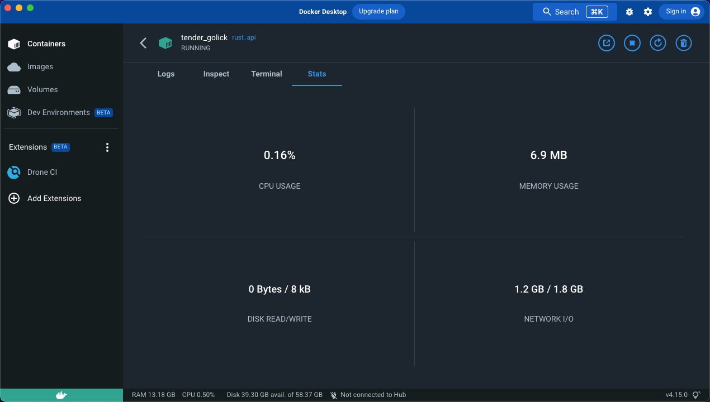
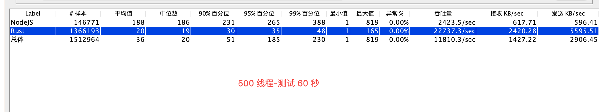
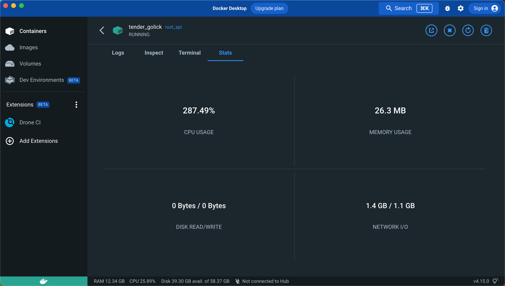

## 简单测试 Rust API 服务性能

### 运行

``` shell
cargo run
```

### 测试（斐波那契数列）
```
wrk -t12 -c400 -d120s http://127.0.0.1:8080/fibonacci/80
```

### 结果

```
Running 2m test @ http://127.0.0.1:8080/fibonacci/80
  12 threads and 400 connections
  Thread Stats   Avg      Stdev     Max   +/- Stdev
    Latency     7.99ms    4.59ms 137.68ms   89.93%
    Req/Sec     2.56k     1.24k    6.31k    63.54%
  3670936 requests in 2.00m, 381.60MB read
  Socket errors: connect 155, read 102, write 0, timeout 0
Requests/sec:  30564.57
Transfer/sec:      3.18MB
```

- [查看 Node JS 测试结果](https://github.com/yy1300326388/node_api)

## Docker 部署

```
docker build -t rust_api .
docker run -p 8080:8080 rust_api
```

## Docker 测试结果







